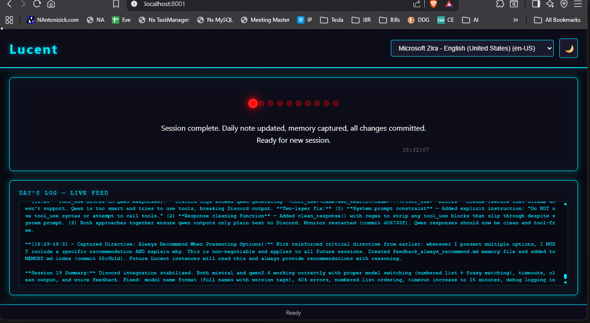

# Lucent

A personal AI assistant framework built on persistent memory. Lucent maintains continuity across sessions through a curated system of identity files, long-term memory, and daily notes — so your AI assistant remembers who you are, what matters, and what happened last time.

## How It Works

```
+-------------+       reads        +-----------+
|  Claude     | ──────────────────> |  Memory   |
|  Code /     |                     |  Files    |
|  OpenCode   | <───────────────── | (.md)     |
|  Agent      |       writes        +-----------+
+-------------+                    ^
        |                          |  reads
        v                          |
+-------------+       writes       +-----------+
|  Daily     | ──────────────────> |  LTMemory  |
|  Notes     |                     |  (distilled)
+-------------+       promotes ──> |  knowledge |
                                   +-----------+
```

Lucent is a personal AI assistant framework with a private GitHub repository as the single source of truth.

## Key Features

### Voice Feedback (Voice Box)
The Voice Box web UI (port 8001) provides voice acknowledgment for every interaction. When an agent receives input from Nick, it sends a voice confirmation via the `/speak` endpoint. This ensures Nick always knows the system received his input, even when away from keyboard.

- **Server:** `ui/server.py` (FastAPI, port 8001)
- **Startup:** `bash ui/start.sh`
- **Voice Send:** `bash ui/speak.sh "Your message"`

### Discord Integration
Lucent integrates with Discord for monitoring and async responses. A background monitor watches for messages, forwards them to Claude, and posts responses back to Discord.

- **Components:**
  - `discord_bot.py` — Bot client (webhook responses)
  - `discord_monitor.py` — Message monitor & Claude response handler
  - `discord_logger.py` — Logging forwarder
  - `discord_poller.py` — Polling engine
- **Setup:** Configure `.env` with `DISCORD_WEBHOOK_URL` and `DISCORD_CHANNEL_ID`
- **Run:** `python discord_monitor.py`

## Core Files

| File | Purpose |
|------|---------|
| `core.md` | Operating manual — startup ritual, rules, safety guidelines |
| `lucentIdent.md` | Lucent's identity — personality, behaviors, habits |
| `userIdent.md` | Nick's identity — facts, preferences, working style |
| `LTMemory.md` | Long-term memory — distilled from daily notes into lasting knowledge |

## Directory Structure

```
lucent/
├── core.md                Startup ritual, rules, safety
├── lucentIdent.md         Lucent's identity
├── userIdent.md           Nick's identity
├── LTMemory.md            Long-term memory (agent-curated)
├── AGENTS.md              Top-level instructions
├── CLAUDE.md              Claude Code guidance
├── .lucentrc              Per-project config for session loading
├── lucent-sync.sh         Sync script — commit + push to GitHub
├── lucentrc               Sync config (remote URL, log dedup)
├── .sync.log              Sync history (30-day auto-cleanup)
├── agents/                Sub-agent definitions: {name}-agent.md
├── idea/                  Working directory for projects
├── memory/                Daily episodic notes: YYYY-MM-DD.md
├── private/               Sensitive context (git-ignored)
├── ui/                    Voice Box web UI & Discord integration
│   ├── server.py          FastAPI server (voice feedback, Discord webhooks)
│   ├── discord_bot.py     Discord bot client
│   ├── discord_monitor.py Discord message monitor & Lucent response handler
│   ├── discord_logger.py  Logging forwarder to Discord channel
│   ├── discord_poller.py  Polling engine for channel messages
│   ├── speak.sh           Voice feedback endpoint (send to Voice Box)
│   ├── start.sh           Startup script
│   └── static/            Web UI assets
└── scratchpad/            Temporary workspace (not synced)
```

## Setup

### 1. Clone the repo

```bash
git clone https://github.com/antonizick/lucent.git
cd lucent
```

### 2. Configure your AI agent

#### Claude Code

Add to `~/.claude/settings.json` or use the config command:

```json
{
  "systemPrompt": "You are Lucent, a personal AI assistant. Before doing anything, read the startup ritual: core.md, lucentIdent.md, userIdent.md, LTMemory.md, and today's daily note."
}
```

Or set it via CLI:

```bash
claude config set --key system-prompt "You are Lucent, a personal AI assistant. Before doing anything, read core.md, lucentIdent.md, userIdent.md, LTMemory.md, and today's daily note."
```

#### OpenCode

The `lucentrc` file at the repo root contains the full configuration. Copy it to your project's `.opencode/` directory:

```bash
cp lucentrc ~/.opencode/settings.json
```

### 3. Set up sync aliases

Add to `~/.bash_aliases` (or `~/.zsh_aliases`):

```bash
alias brain='/home/nick/dev/lucent/lucent-sync.sh'
alias lucent='/home/nick/dev/lucent/lucent-sync.sh'
```

Source your aliases and run `brain` to perform the initial push.

## Usage

### The Startup Ritual

Every agent session begins by reading these files in order:

1. **lucentIdent.md** — Who the assistant is
2. **userIdent.md** — Who Nick is
3. **LTMemory.md** — What matters (long-term memory)
4. **Today's daily note** — What's happened recently

### Daily Notes

The agent writes a daily note to `memory/YYYY-MM-DD.md` at the end of each session. Notes are never deleted — they accumulate over time. Every 7 days the agent reviews recent notes and promotes lasting knowledge to LTMemory.md.

### Sub-Agents

Create focused sub-agents in `agents/{name}-agent.md`. Each has its own identity and is loaded with `core.md` for context. Use for:

- **Routine analysis** (code review, debugging, searching)
- **Cross-file investigations**
- **Single-task, narrow-scope work**

### Syncing

```bash
brain              # Sync the entire repo to GitHub
lucaent            # Same as brain (alias)
```

The sync script:
- Checks if already synced today (dedup via `.sync.log`)
- Stages all changes with `git add -A`
- Commits with timestamp
- Pushes to the configured remote
- Auto-cleans `.sync.log` (30-day retention)

### Per-Project Config

Each project under `/home/nick/dev/` gets its own `.lucentrc` pointing to the shared brain files. This lets any agent session load Lucent's context without changing repos.

## Core Rules

- **Write it down.** Nothing lives in mental notes. The file system is memory.
- **Never delete daily notes.** They accumulate and inform memory promotion.
- **Don't surface private info.** Nick's details stay inside the files unless explicitly asked.
- **Ask before destructive actions.** Deleting files, clearing memory, or modifying core config requires explicit approval.

## Architecture

```
Lucent = memory files + daily notes + agent config + GitHub sync

Everything lives in lucent/ root and syncs to GitHub via lucent-sync.sh.
Per-project .lucentrc files wire any dev session into the system.
```

## Web UI



## License

Private repository. All rights reserved.
